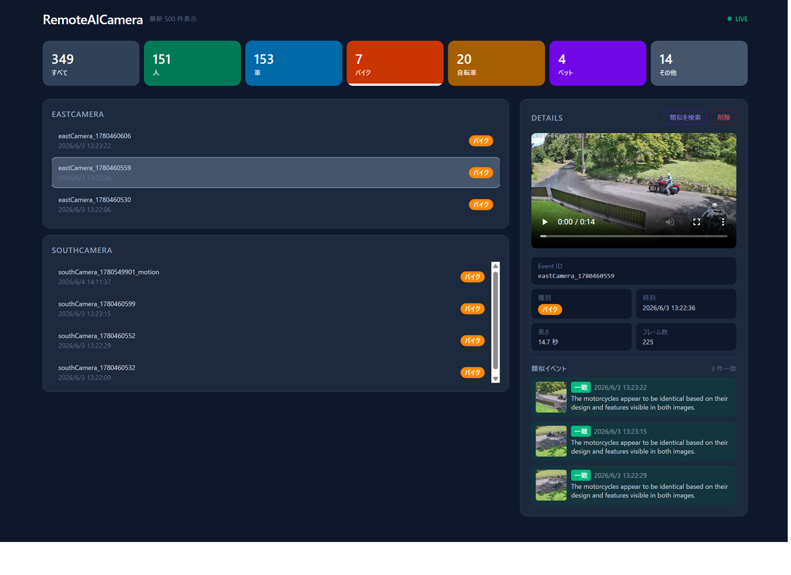

# RemoteAICamera

TP-Link Tapo C520W カメラ + ローカル AI (LM Studio) を使った、プライベート監視・人物/車両認識・記録システム。

クラウド不使用・完全ローカル動作を優先設計。

---

## 機能概要

| フェーズ | 機能 | 状態 |
|---|---|---|
| Phase 1 | RTSP受信・ONVIF駆動イベント検知・YOLOv8全クラス分類・静止画/動画保存・SQLite記録 | ✅ 完了 |
| Phase 2 | 顔認識 (InsightFace)・ナンバープレート認識 (EasyOCR) | 🔲 予定 |
| Phase 3 | Ollama連携・カテゴリ別画像類似判定（Qwen2.5-VL）・類似検索UI | ✅ 完了 |
| Phase 4 | Web ダッシュボード (FastAPI + React) | ✅ 完了 |

---

## システム構成

```
Tapo C520W
 ├─[RTSP]────► RTSPCapture (常時受信・20秒リングバッファ)
 │
 └─[ONVIF]───► poll_events() (2秒ポーリング)
                     │
             [検知シグナル]
                     │
             handle_clip() ← 別スレッド
                     │
        ┌────────────┴──────────────────┐
        │ sleep(12s) ← ポストロール     │
        │ get_recent_frames(15s)        │
        │ ClipAnalyzer.analyze()        │
        │ → YOLO 全80クラス推論         │
        │ → 6カテゴリ分類               │
        │   (人/車/バイク/自転車/ペット/その他)
        │ → best_frame + detections保存 │
        │ EventStore.save_event()       │
        └───────────────────────────────┘
                     │
             FastAPI サーバー (port 8000)
                     │
             React ダッシュボード
```

複数カメラは各自スレッドで並列処理。YOLOv8モデルは全カメラで共有 (VRAM節約)。

---

## YOLO 検出カテゴリ

YOLOv8s (COCO 80クラス) の検出結果を以下の6カテゴリに集約します。

| カテゴリ | COCOクラス |
|---|---|
| 人 (person) | person (0) |
| 車 (car) | car (2), bus (5), truck (7) |
| バイク (motorcycle) | motorcycle (3) |
| 自転車 (bicycle) | bicycle (1) |
| ペット (pet) | cat (15), dog (16), horse (17), 他動物 |
| その他 (other) | 上記以外の検出 |

---

## 動作環境

| 項目 | 要件 |
|---|---|
| OS | Windows 11 |
| Python | 3.11 以上 |
| GPU | NVIDIA RTX シリーズ (CUDA 12.x) |
| カメラ | TP-Link Tapo C520W (RTSP/ONVIF対応) |
| AI推論 | Ollama (Qwen2.5-VL 7B, Phase 3) |

開発・検証環境: RTX 4060 16GB / CUDA 12.8 / PyTorch cu126

---

## セットアップ

### 1. リポジトリのクローン

```bash
git clone https://github.com/yisikawa/RemoteAICamera.git
cd RemoteAICamera
```

### 2. 仮想環境の作成

```bash
python -m venv .venv
.venv\Scripts\activate
```

### 3. 依存パッケージのインストール

`setup.bat` を実行します (PyTorch CUDA + 全パッケージを一括インストール)。

```bat
setup.bat
```

手動で行う場合:

```bash
# PyTorch (CUDA 12.6 ホイール / CUDA 12.8 互換)
pip install torch torchvision --index-url https://download.pytorch.org/whl/cu126

# その他パッケージ
pip install -r requirements.txt
```

### 4. フロントエンドのビルド

```bash
cd frontend
npm install
npm run build
cd ..
```

### 5. 設定ファイルの作成

```bash
copy config.yaml.example config.yaml
```

`config.yaml` を編集してカメラ情報を入力します。

```yaml
cameras:
  - name: "frontCamera"
    host: "192.168.1.100"           # カメラの IP アドレス
    stream_username: "admin"        # RTSPユーザー名
    stream_password: "your_password"
    onvif_port: 2020                # Tapo C520W: 2020
    rtsp_stream: 1
```

> **カメラIPの確認方法**
> ```bash
> python discover.py --password YOUR_PASSWORD
> ```

### 6. 起動

```bash
python main.py
```

ブラウザで `http://localhost:8000` を開くとダッシュボードが表示されます。

---

## ディレクトリ構成

```
RemoteAICamera/
├── camera/
│   ├── tapo_client.py      # ONVIF接続・イベント取得
│   └── rtsp_capture.py     # RTSP受信・自動再接続・フレームバッファ
├── pipeline/
│   ├── detector.py         # YOLOv8 GPU推論・80クラス・6カテゴリマッピング
│   ├── clip_analyzer.py    # 15秒クリップ分析・ベストフレーム抽出
│   └── event_filter.py     # イベントフィルタリング
├── api/
│   ├── server.py           # FastAPI アプリ
│   ├── ws_manager.py       # WebSocket リアルタイム通知
│   └── routes/             # REST API エンドポイント
├── frontend/
│   ├── src/                # React + TailwindCSS ソース
│   └── dist/               # ビルド成果物 (gitignore)
├── db/
│   ├── models.py           # SQLite ORM モデル定義
│   └── store.py            # DB操作ファサード
├── storage/
│   └── file_store.py       # 静止画・動画クリップ保存
├── data/                   # (gitignore) 実行時に自動生成
│   ├── snapshots/          # 静止画 (日付フォルダ別)
│   ├── clips/              # 動画クリップ (日付フォルダ別)
│   ├── models/             # YOLOv8 ウェイトキャッシュ
│   └── events.db           # SQLite データベース
├── tools/                  # 開発・登録ツール
├── main.py                 # エントリーポイント
├── config.py               # 設定ファイルローダー
├── discover.py             # カメラ IP 自動検出ツール
├── config.yaml             # (gitignore) 実際の設定 (パスワード含む)
├── config.yaml.example     # 設定テンプレート
├── requirements.txt        # 依存パッケージ一覧
└── setup.bat               # Windows セットアップスクリプト
```

---

## Web ダッシュボード

`http://localhost:8000` でアクセスできます。

| 機能 | 説明 |
|---|---|
| カテゴリフィルター | 人/車/バイク/自転車/ペット/その他 をクリックで絞り込み |
| イベント一覧 | カメラ別・時系列でイベントを表示（最新500件） |
| 詳細パネル | スナップショット・クリップ動画・検出情報を表示 |
| イベント削除 | 選択したイベントをDBと画像/動画ファイルごと削除 |
| 類似検索 | 同カテゴリのスナップショットをLLMで比較し同一対象を検出 |



---

## カメラの追加

`config.yaml` に `cameras:` ブロックを追加するだけで、自動的に並列スレッドで処理されます。

```yaml
cameras:
  - name: "eastCamera"
    host: "192.168.1.100"
    ...
  - name: "southCamera"
    host: "192.168.1.101"
    ...
```

---

## VRAM 使用量の目安 (RTX 4060 16GB)

| モデル | 使用量 |
|---|---|
| YOLOv8s (常駐) | ~0.5 GB |
| InsightFace buffalo_l (Phase 2) | ~1.0 GB |
| EasyOCR (Phase 2) | ~1.5 GB |
| Qwen2.5-VL 7B via Ollama (Phase 3) | ~6.0 GB |
| **合計 (最大)** | **~9.0 GB** |

---

## ロードマップ

### Phase 2: 顔認識・ナンバープレート認識
- InsightFace による顔エンコーディング登録・照合
- EasyOCR / PaddleOCR による日本語ナンバープレート認識
- 既知人物・既知車両の通過ログ蓄積

### ✅ Phase 3: Ollama ローカル AI 連携（完了）
- Ollama + Qwen2.5-VL 7B による同カテゴリスナップショット類似判定（SAME/DIFFERENT）
- 類似検索 SSE API・ダッシュボード「類似を検索」UI
- 類似判定結果を `event_similarities` テーブルに保存
- 比較対象上限: `SIMILAR_CANDIDATES_LIMIT = 300` 件

### Phase 4 以降（予定）
- 自然言語クエリ対応（「昨日Aさんは何時に来た？」）
- 日次イベントレポート自動生成

---

## 注意事項

- 本システムで取得する映像・顔情報・車両情報は**個人情報保護法**の対象となる場合があります
- **私有地内・私的利用**の範囲で使用してください
- pytapo は非公式ライブラリのため、カメラのファームウェア更新で動作が変わる可能性があります

---

## ライセンス

MIT License
